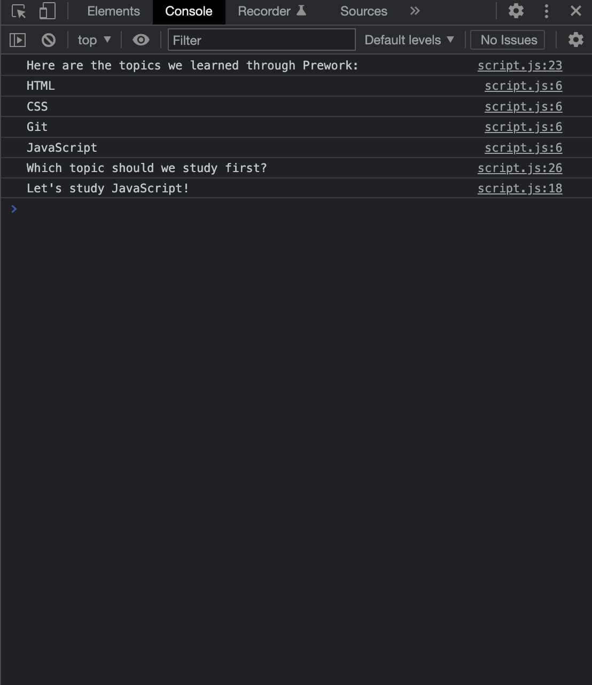

# Prework Study Guide Webpage

## Description

This is a simple webpage I made to track my learning through the prework period of my coding bootcamp course. It contains some notes on HTML, CSS, git and JavaScript. With so much information to digest in such a short amount of time, and recognizing the limits of my own memory, I wanted to document concepts, definitions and commands that stood out as either new to me or critical to remember. This page serves as a resource that can continue to delveop throughout my coursework. It also serves as a touchstone for my first foray into the world of grown up coding!

## Installation

N/A

## Usage

To use this Study Guide, you can review the notes in each section. For suggestions on what to study first, open the Chrome DevTools by pressing Command+Option+I (MacOS) or Control+Shift+I (Windows). A console panel should open up either below or to the side of the webpage in the browser (see image below). There you will see a list of topics we learned from Prework, along with a suggestion on which topic to study first.

## Credits

N/A

## License

Please see the LICENSE in the repo.

## Badges

